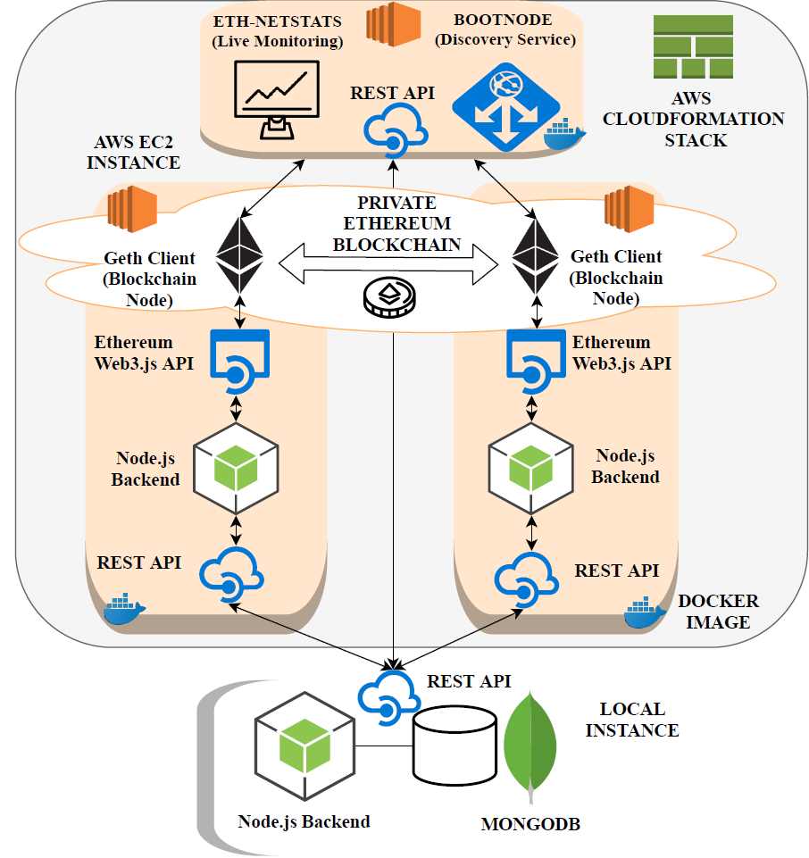

# Framework for Benchmarking the Performance of Differently Configured Private Ethereum Networks (using Geth)

This is the repository for my diploma-thesis, which is related to Ethereum performance and scalability measurements.
The aim is to benchmark metrics of differently configured Ethereum networks.

# Attention: This is still WORK IN PROGRESS!

# Concept

## Ethereum Network Parameters
- Block Frequency
    - Proof of Work (Ethash): mining difficulty
    - Proof of Authority (Clique): period
- Block size: gasLimit (genesis.json) and targetGasLimit (geth)
- Size of workload: amount of transactions (1-5000)
- Type of workload: smart contract scenario (account, voting)
- Blockchain network size: amount of nodes in the network (1-20)
- Configuration of nodes in the network (CPU, RAM) (different AWS EC2 instances)
- Number of miners (Ethash) or sealers (Clique) in the network

## Metrics
- Throughput: the number of successful transactions per second.
- Latency: the difference between the completion time and the deployment time
- Scalability: measured as the changes in throughput and latency when increasing number and size of nodes

## Scenarios
- Account (transfer of ETH between two smart contracts)
- Voting (modified ballot.sol)

# Architecture

## Startup Procedure for Benchmarks on AWS EC2 instances
- Start REST API and mongoDB on master (via "make master_start")
- Use One of the provided templates for AWS to startup a stack (required software is installed and REST APIs are automatically started on instance startup)
- Start bootnode and netstats (via REST: "node startBootnodeAndNetstats.js")
- Start Geth on nodes (via REST: "node startGethOnNodes.js")
- Deploy smart contract scenario on a node (via REST: e.g. "node deployContracts.js account" or "node deployContracts.js ballot")
- Start benchmarks from master node (via REST: "node startBenchmark.js account" or "node startBenchmark.js ballot")
- Benchmark results are stored on the master DB (send via REST from nodes to master)

## Startup Procedure for Benchmarks on a Local Machine
- Start REST API and mongoDB on master (via "make master_start")
- Start REST API of bootnode and netstats (via "make bootnode_start mode=local")
- Start REST API of node (via "make node_start mode=local") 
- Start bootnode and netstats (via REST: "node startBootnodeAndNetstats.js")
- Start Geth on nodes (via REST: "node startGethOnNodes.js")
- Deploy smart contract scenario on a node (via REST: e.g. "node deployContracts.js account" or "node deployContracts.js ballot")
- Start benchmarks from master node (via REST: "node startBenchmark.js account" or "node startBenchmark.js ballot")
- Benchmark results are stored on the master DB (send via REST from nodes to master)

## Local MongoDB
- start via "mongo" 
- select last entries descending on startTime: "db.benchmarklogs.find().pretty().sort({"startTime":-1})"

# TODO
- Docker for Bootnode+Netstats and Nodes
